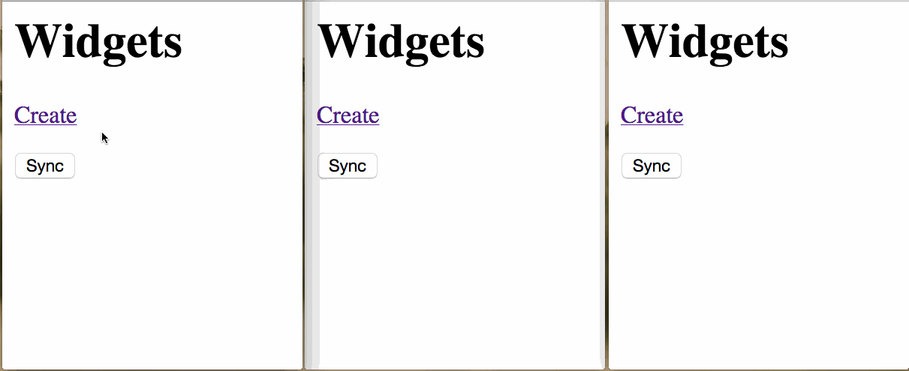

# tbsync

This Django app lets you manage and sync Widgets. When you click the "Sync" button, local changes since last sync are pushed to the server and remote changes since last sync are pulled from the server.

## Setup

1. Install Django 1.5 and South 1.0
2. Run `python manage.py syncdb` and follow prompts
3. Run `python manage.py migrate`
4. Run `python manage.py runserver`
5. Navigate to http://127.0.0.1:8000/cms in a few browser windows

## Discussion

I developed this app over the course of a few hours before I started at [Guidebook](https://guidebook.com/).

Things I would include if doing this again:
- Unit and application tests
- Code documentation
- Refactoring
